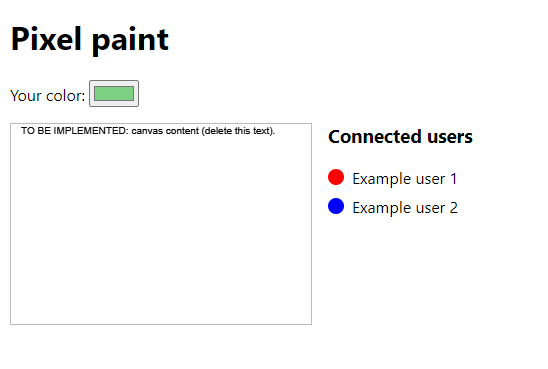

# 3dverse web dev challenge: Pixel Paint
 
## Running the app

We have already set up a boilerplate React app (create-react-app) with an express server backend.

To run it:

- Run `npm install` to install the project dependencies.
- Launch the dev server and express server by running `npm start` and `node server.js` in separate terminals.
- Access the app at [http://localhost:3000](http://localhost:3000).

## What to implement

You will create a collaborative paint app (similar to https://pixelplace.io/). In short:

- You arrive on a page with a canvas.
- You pick a color (or get assigned one randomly), and can click or drag around the page to draw with your color. By "draw" we mean that any touched pixel changes to the user's color.
- You see the new drawings of other connected users in real time.
- Next to the canvas, you see an indication of your currently assigned color, and you also see a list of currently connected users with their names and respective colors.
- Users can have random names generated on the fly (User 1, User 2 for example), but the same user should have the same name across different clients.
- The starter code generates a new color after each refresh, but you will need to make the name and color persist after a page refresh.
- New users arriving on the page should see previous drawings.

## Additional completion criteria 

- All canvas rendering should be done with the browser canvas API.
- Modify the existing websocket code to handle real-time messages.

## Don't overdo it

- We don't recommend changing the size of the canvas in the code. We picked a small fixed size that will display on any device, so you don't need to worry about responsiveness.
- You don't need to install any additional third-party libraries.
- Modifying the REST routes in the express server is not required.
- It is *not* necessary to persist the canvas content after restarting the server. You can restart with a blank canvas.
- "Drawing" means updating the color of an individual pixel in the canvas. Don't worry about connecting lines or tracking changes per user. Any colored pixel should persist until the same pixel is overwritten or the app is restarted.
- It's also not necessary to deal with exceptional network conditions (like connection loss). It's fine to assume that if the user gets disconnected, they will eventually figure it out and just refresh the page. It's ok if the drawings made while the connection was broken are lost.
- Finally, there are no points awarded or deducted for visual style. The app needs to be functional, but not necessarily flashy.

## Sharing your code with us

When you're done, please push to a private repo on GitHub and share it with webtest@3dverse.com.
